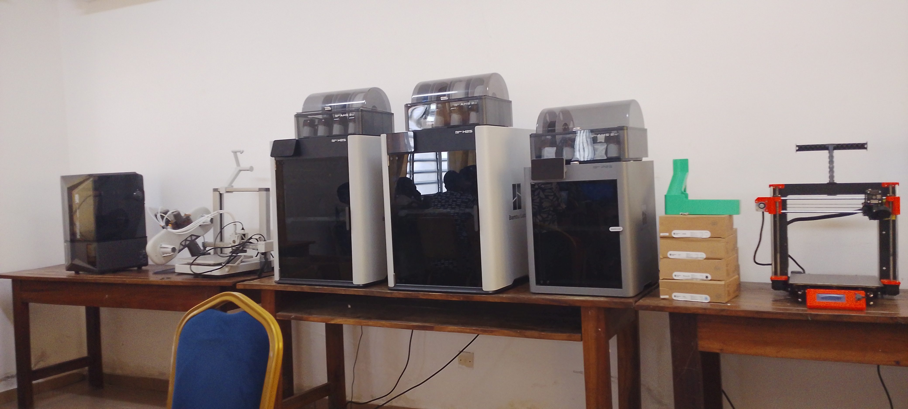

#  JOURNAL DU 26 Août 2026
 AUTEUR : Christelle AMOUZOUGAN

## Fait aujourd'hui
SESSION1: PROJET

*Formateur* : M. ORLANDO 

* Echange sur quelques projets

SESSION 2: DECOUPE LASER

- les différentes types de decoupe Lasers

* le fonctionnement d'un decoupe Laser

SESSION 3: Atelier de l'électronique

*Formateur:* M. ADJARE Koffi wisdom
- les grandeurs électroniques 
- l'appareil de mésure ( le multimètre)

SESSION 4: ATELIER DE L'IMPRESSION 3D 

**Les bases et principes de la fabrication additive**
- introduction à la fabrication additive
- Historique de l'impression 3D
- les différentes types d'imprimantes 3D 

- le fonctionnement de chaque type

## II.Appris 
J'ai appris le fonctionnement de l'imprimante 3D (Bombou Studio)

## III. Raté,puis 
Néant

## v. Décidé
Révisualiser les logiciels installés aujourd'hui
## v.à faire demain
Continuer les différentes atéliers
