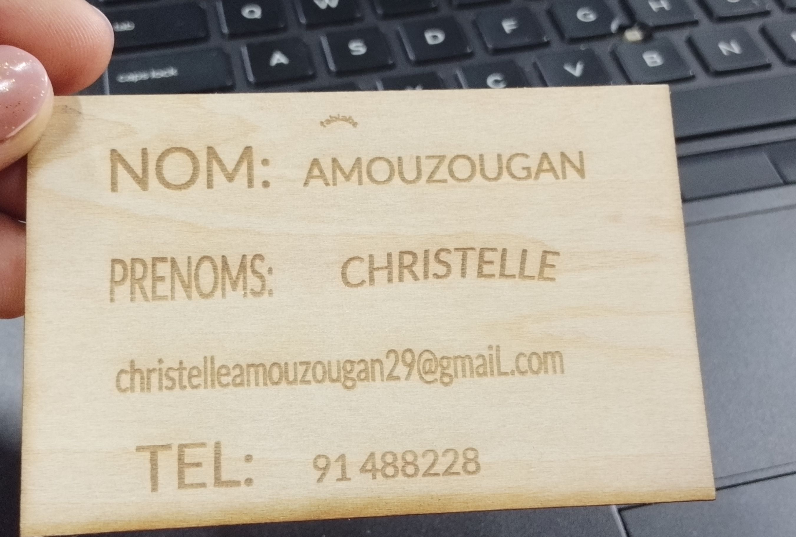

#  JOURNAL DU Vendredi 28 Août 2026
 AUTEUR : Christelle AMOUZOUGAN

## Fait aujourd'hui
SESSION1: DECOUPE LASER
* Révision individuel sur les notions déjà acquises
* Reçu de nos cartes personnalisées

SESSION 2: IMPRESSION 3D
- Notions sur les paramètres de bombou studio
- Impression de foldable_phone_stand_studio
photo

SESSION 3: Atelier de l'électronique
- Codage en bloc avec les conditions (jour-Nuit)
photo

SESSION 4: ATELIER DE L'IMPRESSION 3D

**Les bases et principes de la fabrication additive**
- Démarche d'impression 3D sur Bambu studio

## II.Appris 
J'ai appris le fonctionnement de l'imprimante 3D (Bombou Studio)

## III. Raté,puis 
Néant

## v. Décidé
Révisualisé les logiciels
## v.à faire demain
briefing sur les projets
