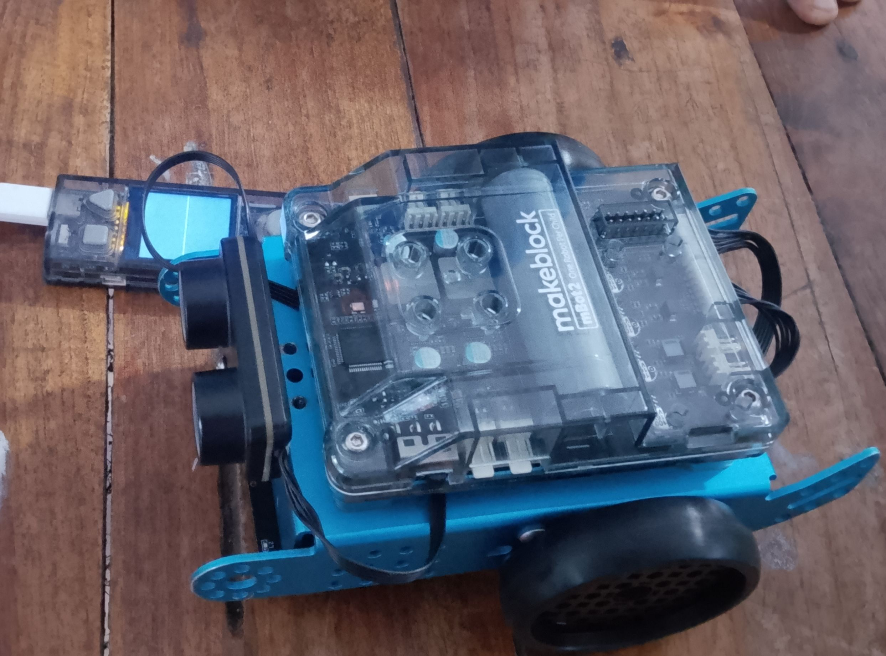

# JOURNAL DU 02 SEPTEMBRE 2026
**Auteur:** AMOUZOUGAN Christelle
## Fait aujourd'hui

>MATINEE: 9h-11h15

SESSION 1: salle KADARING

*MODULE*: LES FONDAMENTAUX D'ALGORITHME POUR UN FABMANEGER

**Formateur** : M. WISDOM

* Définition d'un algorithme, d'un algorithme débranché
* les trois critères d'un algorithme
* Historique et inventeurs de l'algorithme

SESSION 2: (électronique)
- Montage et démontage d'un robot mbot2

- Programmation du cyberPi

>SOIREE: 14h-17h30

SESSION 3: 
* Travail en groupe sur le projet

Esquisse du distributeur automatique du savon liquide  en main levé 

# appris.
- j'ai appris à écrire un algorithme débranché avec des blocks decoupés avec le laser
photo

- j'ai appris à commander un Robot mbot2

# raté
Néant
# à faire demain
continuer par travailler sur le projet