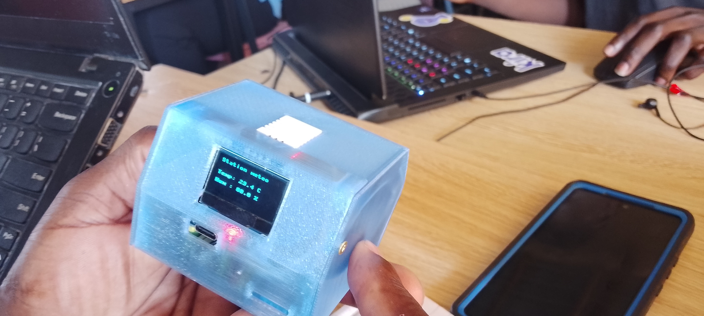

# JOURNAL DU 05 SEPTEMBRE 2026
**Auteur:** AMOUZOUGAN Christelle
## Fait aujourd'hui

>MATINEE: 9h-14h15

SESSION 1:  GRANDE SALLE

*MODULE*: SMART WEATHER STATION

**Formateur** : M. EDJARA

# Fait aujourd'hui

Aujourd'hui, nous avons travaillé sur le projet Smart Weather Station (station météorologique intelligente).

voici un peu son cablage

# j'ai appris

 j'ai appris à créer et à exécuter un programme Python pour un smart weather station, J'ai également réfléchi au fonctionnement général d'une station météorologique intelligente. Le principe est de mesurer différentes grandeurs météorologiques à l'aide de capteurs, puis de traiter et d'afficher les données obtenues.

 j'ai egalement appris
- à créer un fichier Python avec l'extension ".py" ;
- à comprendre le rôle du bouton Run pour exécuter un programme ;
- à utiliser la console pour observer les résultats du programme ;
- à comprendre le rôle des commentaires en Python ;
- à distinguer les capteurs, qui récupèrent les données, du programme, qui traite ces données.

# raté

J'ai rencontré quelques difficultés lors de l'exécution de mon programme Python, notamment avec l'affichage des donnée sur l'ecran OLED. il y avait certains câbles qui se sont déconnectés
je n'avais pas pu faire l'impression 3D du boitier 

# Décision

 nous allons continuer les ateliers, lundi
