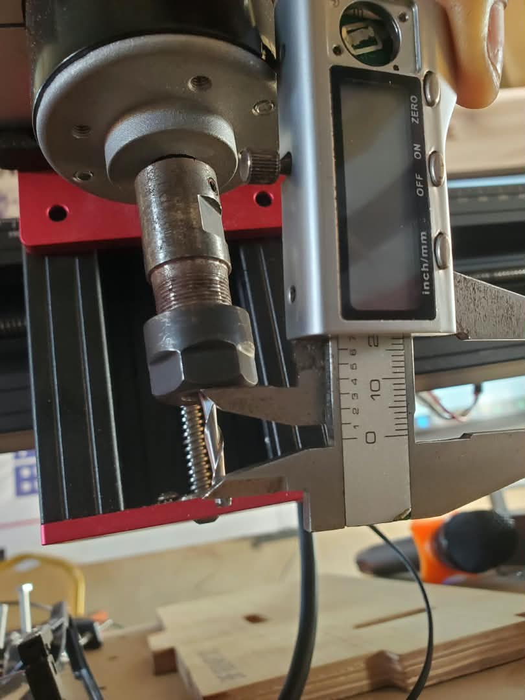

 JOURNAL DU 08 SEPTEMBRE 2026
**Auteur:** AMOUZOUGAN Christelle
## Fait aujourd'hui

>MATINEE: 9h-12H30

SESSION 1: GRANDE SALLE

*MODULE*: FABRICATION ASSITEE PAR L'ORDINATEUR

**Formateur** : M. SITOU

1. Découverte de la FAO

* Définition de la FAO

* Rôle de la FAO dans le processus de fabrication numérique

* Présentation de l’espace Manufacture de Fusion 360

* Différence entre CAO et FAO

2. Flux de travail FAO dans Fusion 360

1. Setup : définition de la pièce, de l’origine et du brut.

2. Création des opérations d’usinage : choix des stratégies d’usinage.

3. Paramétrage : vitesse de coupe, vitesse d’avance, profondeur de passe, engagement radial, etc.

4. Simulation : vérification du parcours d’outil et détection des éventuelles collisions.

5. Génération du G-code

>SOIREE: 14h-17h30

SESSION 2: PROJET

Nous avons continué de travailler sur notre projet d'equipe
nous recu certains de nos matériels notament la carte ESP32S3, panneaux solaires, capteur de distance à ultrasons, plaquette SK 10, les fils de connexions, deux leds, quatre résistances

# raté
Néant
# à faire demain
continuer par travailler sur le projet